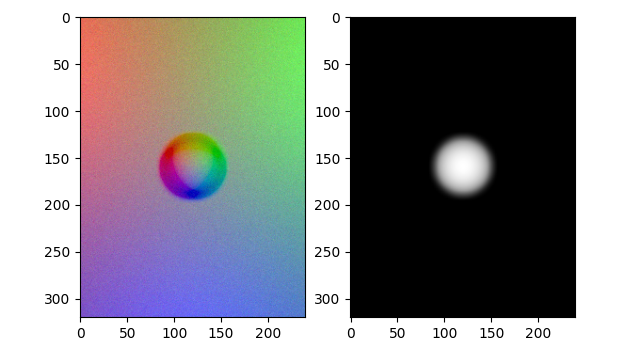

# TACTO Patch


[](https://pepy.tech/project/tacto)

TACTO is a fast, flexible, and open-source simulator for high-resolution vision-based tactile sensors like [DIGIT](https://digit.ml). This is a patched version, compatible with **Python 3.8 to 3.13**.

It provides models for the integration with PyBullet, as well as a renderer of touch readings.
For more information refer to the corresponding paper [TACTO: A Fast, Flexible, and Open-source Simulator for High-resolution Vision-based Tactile Sensors](https://arxiv.org/abs/2012.08456).

<p align="center">
  
</p>

> NOTE: the simulator is not meant to provide a physically accurate dynamics of the contacts (e.g., deformation, friction), but rather relies on existing physics engines.

## Installation

Please manually clone the repository and install the package using:

```bash
pip install tacto@git+https://github.com/zhangzrjerry/TactoPatch.git
```

Alternatively, you can manually clone the repository and install the package using:

```bash
git clone https://github.com/zhangzrjerry/TactoPatch.git
cd TactoPatch
pip install -e .
```

## Content

This package contain several components:

1. A renderer to simulate readings from vision-based tactile sensors.
2. An API to simulate vision-based tactile sensors in PyBullet.
3. Mesh models and configuration files for the [DIGIT](https://digit.ml) and Omnitact sensors.

## Usage

Additional packages ([torch](https://github.com/pytorch/pytorch), [gym](https://github.com/openai/gym), [pybulletX](https://github.com/facebookresearch/pybulletX)) are required to run the following examples.
You can install them by:

```bash
pip install -r requirements/examples.txt
```

For a basic example on how to use TACTO in conjunction with PyBullet look at [TBD],

For an example of how to use just the renderer engine look at [examples/demo_render.py](examples/demo_render.py).

## License

This project is licensed under MIT license, as found in the [LICENSE](LICENSE) file.
